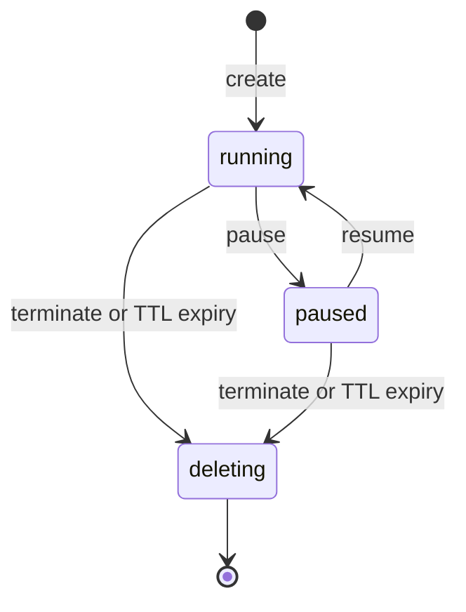

# Lifecycle and timeout budgets

Sandbox lifecycle, automatic deletion, idle pause, command execution, HTTP
requests, and operation polling have different meanings and units. Treat them
as independent budgets. Lifecycle actions in this guide are `/v1` resource
actions; command execution is a separate current non-versioned SDK route.

## Lifecycle states

The `/v1` sandbox resource reports `running`, `paused`, or `deleting`.



```ts
const sandbox = await client.sandboxes.create();
await sandbox.pause();
console.log(sandbox.status); // "paused"
await sandbox.resume();
await sandbox.terminate();
```

<Warning>
  Do not treat `deleting` as usable. A deletion is in progress; terminate is the
  terminal action, not a pause or cleanup hint.
</Warning>

## Timeout decision table

| Need                   | SDK option or method               | Unit         | Default                               | Effect                                                     |
| ---------------------- | ---------------------------------- | ------------ | ------------------------------------- | ---------------------------------------------------------- |
| Auto-delete a sandbox  | `ttlMs`                            | milliseconds | omitted (no expiry)                   | Sets resource lifetime; `0` clears it on update.           |
| Pause after inactivity | `idleTimeoutMs`                    | milliseconds | omitted (server policy)               | Sets idle pause policy; independent of TTL.                |
| Limit a guest command  | `commands.run(..., { timeoutMs })` | milliseconds | 60,000                                | Guest command is killed when it exceeds the budget.        |
| Bound one HTTP request | `requestTimeoutMs`                 | milliseconds | 30,000 ordinary; 300,000 create/batch | Stops the client waiting for that request.                 |
| Snapshot request       | `createSnapshot()`                 | milliseconds | fixed 300,000                         | `SnapshotOptions` has no request-timeout override.         |
| Bound batch polling    | `operation.wait({ timeoutMs })`    | milliseconds | 300,000                               | Stops local polling; does not cancel the server operation. |
| Bound PTY connection   | `pty.create({ connectTimeoutMs })` | milliseconds | 30,000                                | Stops waiting for WebSocket establishment.                 |

Milliseconds passed to lifecycle and command methods are rounded **up** to whole
seconds for the API. For example, `ttlMs: 10_001` becomes 11 seconds.

## Update lifecycle policy

```ts
await sandbox.update({
  ttlMs: 30 * 60_000,
  idleTimeoutMs: 10 * 60_000,
});

// Clear an existing TTL. This does not alter idle policy.
await sandbox.update({ ttlMs: 0 });
```

## Timeouts are not cancellation

| If this expires            | What has happened                                                                            | What to do                                                                    |
| -------------------------- | -------------------------------------------------------------------------------------------- | ----------------------------------------------------------------------------- |
| Command `timeoutMs`        | The guest command was killed; SDK throws `TimeoutError`.                                     | Inspect logs/output and rerun only if safe.                                   |
| HTTP `requestTimeoutMs`    | The client request was aborted or timed out; server work may or may not have been cancelled. | Reconcile with the stable idempotency key and known resource or operation ID. |
| `operation.wait()` timeout | Local polling stopped; operation can still finish. The SDK currently throws a plain `Error`. | Save `operation.id`, then use `client.operations.get(id)` to resume polling.  |
| TTL                        | Sandbox is deleted.                                                                          | Create a new sandbox or use a retained snapshot.                              |

<Note>
  `Operation.wait()` timeout is not currently a `TimeoutError`; catch it as a
  general `Error` if you need to distinguish it from the typed SDK errors.
</Note>

## Next steps

- [Run buffered or streaming commands](commands-streaming)
- [Create snapshots and batch operations](snapshots-batches)
- [Handle retryable capacity errors](errors-retries)
