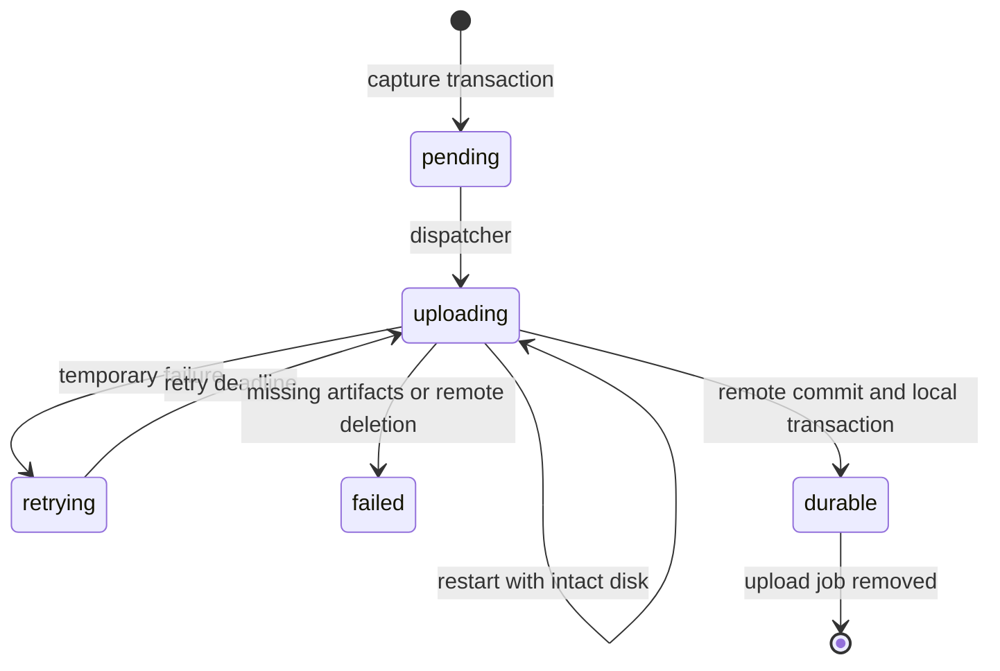

# Snapshot upload recovery

Snapshot uploads survive a worker restart when its SQLite database and snapshot
files remain intact. Capture commits the snapshot and its upload job in one
transaction, then returns without waiting for object storage. This change is
deployed to the development gateway and both workers as
`fb09662-dev-20260906052209` on September 6, 2026.

## Ownership and recovery

Only the capturing worker creates a `snapshot_uploads` record. Peer and
object-store imports use the ordinary snapshot insertion path, which ignores
copied upload status. Imported copies and ambiguous pre-upgrade local rows
do not automatically become upload jobs.

The server dispatches at most two uploads concurrently. It scans persisted work
every second and wakes after capture or completion. An `uploading` row without
an active local attempt is eligible again after interruption. Transient storage
failures retry with exponential backoff, capped at one minute with jitter.
Each attempt has a 30-minute deadline. Missing artifacts produce a terminal,
inspectable failure.



SQLite owns pending work. The in-memory map holds cancellation handles.
Shutdown cancels and joins active attempts, leaving their intent recoverable.
Admission to the shared base uploader is also cancellable, so deletion cannot
wait on another base upload's network timeout.

The implementation lives in
[registry/snapshot_uploads.go](../internal/registry/snapshot_uploads.go),
[server/snapshot_uploads.go](../internal/server/snapshot_uploads.go), and
[server/snapshot_gcs.go](../internal/server/snapshot_gcs.go).

## Publication and deletion

Uploads write the base if needed, then disk, memory, and device state. The final
`snaps/<id>/meta.json` object commits the snapshot. If that commit succeeded
before a process or SQLite failure, recovery completes the local transaction
without uploading the artifacts again.

Publication creates `meta.json` only if it is absent. Deletion overwrites that
same object with a permanent tombstone. A delayed publisher cannot overwrite
the tombstone, even if deletion ran on another worker. This uses GCS's
generation-zero write precondition. [GCS request preconditions](https://docs.cloud.google.com/storage/docs/request-preconditions).

Local deletion holds the snapshot lock, cancels and joins its uploader, writes
the tombstone, then removes the row and files. The job disappears through its
foreign key. Payload cleanup leaves the tombstone intact. Storage failure
returns an error and retains local recovery state; it returns 404 only when
the snapshot is absent.

Stale golden snapshots retire to an internal base role. Their files remain
available to dependent differential snapshots while a replacement becomes
active. Retired bases stay hidden from public snapshots and templates. This
replaces cleanup that ignored a dependency error and still removed the files.

## Client contract

Public `state` remains `local` or `durable`. An unfinished creator upload adds
an optional projection:

```json
{
  "state": "local",
  "upload": {
    "state": "retrying",
    "attempts": 2,
    "next_attempt_at": "2026-09-06T05:24:56.728Z",
    "error": "Snapshot upload failed; retry scheduled."
  }
}
```

Upload states are `pending`, `uploading`, `retrying`, and `failed`. Successful
completion removes the projection. Gateway deduplication preserves a known
durable copy and otherwise preserves creator status over a peer without a job.

```ts
const snapshot = await sandbox.createSnapshot()
const durable = await client.snapshots.waitForDurable(snapshot.id, {
  timeoutMs: 120_000,
  signal: abortController.signal,
})
```

The wait covers retries, backoff, and response-body reads. It throws
`SandboxError` with code `snapshot_upload_failed` for terminal failure and
`TimeoutError` at the deadline. Timeout or abort stops waiting without
cancelling the background upload.

## Verification

The [live report](verification/snapshot-recovery-2026-09-06/live-recovery.json)
records a storage outage and abrupt restart on the source, followed by
restoration on the other worker through object storage.

| Observation | Result |
| --- | --- |
| Local capture with storage access blocked | Returned in 1051 ms |
| Persisted failure before restart | `local`, retrying, attempt 1 |
| Worker restart | PID 110961 changed to 111442 |
| Recovery before storage access returned | Same snapshot ID, retrying, attempt 2 |
| Storage restored | Reached `durable`; upload job removed |
| Cross-worker restore | Matching SHA-256 for 256 MiB of memory and an 8 MiB file |
| Process continuation | Same in-memory nonce; timer advanced from 1 to 14 |
| Cleanup | No errors; source, clone, and both snapshot copies deleted |

The capture time is one fault-test observation, not a latency percentile or
throughput claim. The destination had no copy of this new snapshot, and its
direct-worker restore request supplied no peer hint.

Final [source](verification/snapshot-recovery-2026-09-06/final-source.json) and
[target](verification/snapshot-recovery-2026-09-06/final-target.json) checks found
zero upload jobs, temporary firewall rules, or empty cgroups. Each worker had
eight warm guests reserving 9440 MiB. The
[fleet inventory](verification/snapshot-recovery-2026-09-06/final-inventory.json)
confirms both workers are healthy and the pre-existing hibernated sandbox and
snapshot remain intact.

Race tests passed for the server, registry, storage client, public API, gateway,
and command packages. Real SQLite reopen and HTTP object-store fixtures cover
atomic rollback, retry, interruption, remote-commit/local-state recovery,
deletion races, missing artifacts, import exclusion, and cancellation while
waiting for base upload admission. The full SDK suite, typecheck, and build
passed. Wait tests include stalled response bodies, retry backoff, and abort.
Full gateway REST and WebSocket PTY smoke passed after deployment.

To repeat from the control VM checkout against an idle development source:

```bash
. infra/gcp/fleet-secrets.env
export SANDBOX_API_KEY="$HOST_TOKEN"
export SANDBOX_RELEASE=<observed-worker-release>
python3 scripts/verify-snapshot-recovery.py \
  --source-url http://10.128.0.28:8080 \
  --target-url http://10.128.0.35:8080 \
  --source-ssh ayush@10.128.0.28 \
  --identity "$HOME/.ssh/google_compute_engine" \
  --output /tmp/snapshot-recovery.json
```

The script temporarily rejects root-owned outbound HTTPS and kills the source
serve process. It arms an independent three-minute cleanup timer before adding
the firewall rule. Normal completion removes the rule, stops the timer, and
deletes test resources. Nomad must restart the worker.

## Boundaries and next work

Loss of the only worker disk before upload commits still loses the snapshot.
Recovery does not infer ownership for legacy local rows. Permanent tombstones
and retired bases need a separate garbage-collection policy.

The deletion fence prevents remote publication from resurrecting a snapshot.
It does not revoke downloaded copies or make fleet inventories globally
consistent. Cached records can remain stale after deletion. Old unconditional
uploader binaries must be stopped before relying on the new fence; both dev
workers completed the rollout.

The subsequent [create operation recovery](create-operation-recovery.md) change
persists public single and batch creates, selected-worker assignment, and worker
request replay linked atomically to allocation or warm-pool promotion. Other
public mutation idempotency remains process-local.
